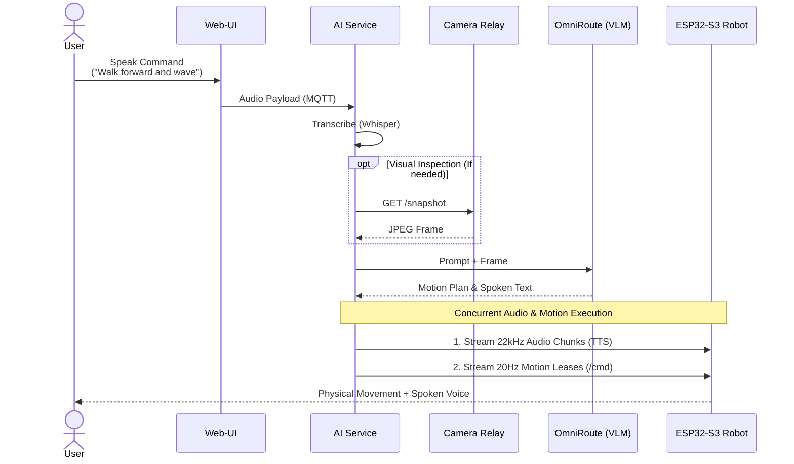
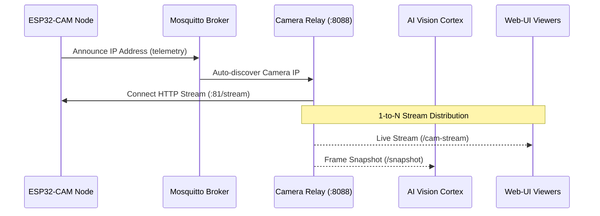

# Hexapod V2 — Pi-Hub Gateway & Edge AI System

[](https://www.raspberrypi.com/software/)
[](https://www.python.org/)
[](https://mosquitto.org/)
[](https://nginx.org/)
[](https://github.com/)
[](LICENSE)

**Pi-Hub** is the central computing, networking, and cognitive intelligence hub for the **Hexapod V2** robotics platform. Operating on a Raspberry Pi, it unifies physical hardware telemetry (ESP32-S3 kinematics and ESP32-CAM vision) with high-level multimodal AI capabilities, real-time audio/video relays, and a unified ingress gateway for both remote and offline operation.

---

## Table of Contents

- [System Architecture](#system-architecture)
- [Core Workflows](#core-workflows)
  - [1. Multimodal Voice & Motion Execution](#1-multimodal-voice--motion-execution)
  - [2. Dynamic Camera Discovery & Relay](#2-dynamic-camera-discovery--relay)
- [Directory Structure](#directory-structure)
- [Prerequisites](#prerequisites)
- [Installation & Deployment](#installation--deployment)
- [Configuration Reference](#configuration-reference)
- [MQTT Communication Protocol](#mqtt-communication-protocol)
- [Cognitive Skills & Tool Registry](#cognitive-skills--tool-registry)
- [Diagnostics & Verification](#diagnostics--verification)
- [Extending the System](#extending-the-system)
- [License](#license)

---

## System Architecture

The Pi-Hub acts as a multi-tier bridge orchestrating communication between the robot's microcontrollers, client applications, and cloud/local AI providers:

```mermaid
flowchart TD
    subgraph Layer1 ["Client Tier"]
        UI["Web-UI / Mobile Client"]
    end

    subgraph Layer2 ["Pi-Hub Gateway Tier"]
        NGINX["Nginx Gateway<br/>(:80 / :443)"]
        MQTT["Mosquitto Broker<br/>(:1883 TCP / :9001 WS)"]
        CAM["Camera Relay<br/>(:8088)"]
        AI["AI Cognitive Service<br/>(hexapod-ai)"]
        OMNI["OmniRoute Gateway<br/>(:20128/v1)"]
    end

    subgraph Layer3 ["Hardware Tier"]
        S3["ESP32-S3 Controller<br/>(18-DOF IK & Audio)"]
        CAM_HW["ESP32-CAM<br/>(OV2640 MJPEG)"]
    end

    UI -->|HTTPS / WSS| NGINX
    NGINX -->|/mqtt| MQTT
    NGINX -->|/cam-stream| CAM

    MQTT <-->|Commands & State| AI
    MQTT <-->|Kinematics & Audio| S3
    CAM_HW -.->|Announce IP| MQTT

    AI <-->|VLM API| OMNI
    AI <--|Snapshot Frame| CAM
    CAM_HW -->|MJPEG Pull| CAM
```

---

## Core Workflows

### 1. Multimodal Voice & Motion Execution

Speech input is transcribed, visually grounded via camera snapshots, reasoned over by the VLM, and dispatched concurrently as synthesized audio and 20 Hz kinematic control leases:



### 2. Dynamic Camera Discovery & Relay

The relay tracks the ESP32-CAM IP across networks via MQTT and fans out the single stream to web viewers and AI perception loops:



---

## Directory Structure

```
pi-hub/
├── conf/                           # Canonical environment & service configurations
│   ├── ai.env                      # LLM models, endpoints, and TTS settings
│   ├── cam_relay.env               # Camera relay ports and discovery mode
│   ├── hotspot.env                 # Access point SSID/passphrase and interfaces
│   ├── mosquitto.conf              # Mosquitto TCP (1883) and WebSocket (9001) listeners
│   ├── mqtt.service                # Avahi mDNS discovery definition
│   ├── nginx-gateway.conf          # Ingress routing rules & SSL certificate bindings
│   └── omniroute.env               # OmniRoute gateway configuration & API keys
├── scripts/                        # Layered system installation & setup scripts
│   ├── 01_setup_network.sh         # NetworkManager Hotspot & NAT masquerade
│   ├── 02_setup_broker.sh          # Mosquitto MQTT & Avahi mDNS installer
│   ├── 03_setup_gateway.sh         # Nginx ingress gateway configuration
│   ├── 04_setup_omniroute.sh       # OmniRoute proxy deployment
│   ├── 05_setup_tailscale_https.sh # Tailscale TLS automated ingress
│   ├── 06_setup_offline_https.sh   # 10-Year local SAN SSL generator
│   ├── 07_setup_tailscale_cert.sh  # MagicDNS Let's Encrypt certificate retriever
│   └── pi-status.py                # Comprehensive hub diagnostic CLI
└── services/                       # Standalone daemons and AI modules
    ├── ai-service/                 # Multimodal AI, Voice, and Embodied Agent daemon
    │   ├── ai_service.py           # Main MQTT loop & task coordinator
    │   ├── action_parser.py        # Keyword matcher & kinematics compiler
    │   ├── actions.json            # Canonical robot physical action table
    │   ├── animations.json         # Dynamic keyframe animation library
    │   ├── embodied_agent.py       # Procedural multi-step task compiler
    │   ├── memory_manager.py       # Rolling session history & persistent pool
    │   ├── pipeline.py             # Cognitive intent & execution coordinator
    │   ├── selftest.py             # Regression test suite
    │   ├── providers/              # STT (Whisper), TTS (Piper/Cloud), LLM (OpenAI/VLM)
    │   ├── skills/                 # Media, Search, Time, and Weather skills
    │   └── deploy/                 # Systemd unit & installer scripts
    ├── cam-relay/                  # Dynamic 1-to-N MJPEG fanout proxy
    │   ├── cam_relay.py            # Asyncio HTTP server & auto-discovery worker
    │   └── deploy/                 # Systemd unit & installer scripts
    └── omniroute/                  # OmniRoute AI reverse proxy
        └── deploy/                 # Systemd unit definition
```

---

## Prerequisites

- **Hardware:** Raspberry Pi 4 Model B or Raspberry Pi 5 (4GB+ RAM recommended for local STT/TTS).
- **OS:** Raspberry Pi OS (64-bit, Debian Bookworm or Bullseye).
- **Core Dependencies:**
  ```bash
  sudo apt-get update && sudo apt-get install -y \
      git curl wget python3 python3-pip python3-venv \
      ffmpeg mpv network-manager iptables-persistent avahi-daemon
  ```

---

## Installation & Deployment

Follow these sequential steps to reproduce the complete Pi-Hub environment on a fresh Raspberry Pi:

### 1. Clone & Configure
```bash
cd /home/spider
git clone <repository-url> pi-hub
cd pi-hub

# Review and edit environment parameters
nano conf/ai.env
nano conf/hotspot.env
```

### 2. Run Layered System Setup
```bash
# Layer 1: Network Gateway, Hotspot, and NAT Masquerading
bash scripts/01_setup_network.sh

# Layer 2: Mosquitto MQTT Broker (TCP 1883 & WS 9001) + Avahi mDNS
bash scripts/02_setup_broker.sh

# Layer 3: Nginx Gateway & Web-UI Ingress
bash scripts/03_setup_gateway.sh

# Layer 4: OmniRoute AI Gateway Service
bash scripts/04_setup_omniroute.sh

# Layer 5: Tailscale TLS Integration (Optional, for remote domains)
bash scripts/05_setup_tailscale_https.sh

# Layer 6: Offline 10-Year SAN SSL Certificate Generation
bash scripts/06_setup_offline_https.sh
```

### 3. Deploy Background Daemons & Models
```bash
# Install & Enable Camera Relay Service
bash services/cam-relay/deploy/install-cam-relay.sh

# Install & Enable Hexapod AI Service (downloads Faster-Whisper and Piper models)
bash services/ai-service/deploy/install-ai-service.sh
```

---

## Configuration Reference

Canonical configuration templates reside in `conf/` and are copied to `/etc/` during deployment.

### `conf/ai.env`
```ini
DEVICE_ID="hexapod-s3-01"
CAM_DEVICE_ID="hexapod-cam-01"
LLM_ENABLED=1

# OmniRoute or OpenAI-Compatible API Endpoint
LLM_BASE_URL="http://127.0.0.1:20128/v1"
LLM_API_KEY="spiderbot"

# Target Models
LLM_MODEL="hexapod-vision"
LLM_VISION_MODEL="hexapod-vision"
SNAPSHOT_URL="http://127.0.0.1:8088/snapshot"

# Speech Configuration
TTS_MODEL="local"          # "local" (Piper 100% offline) or "hexapod-voice"
TTS_VOICE="alloy"
TTS_TIMEOUT_S=3.0
```

### `conf/cam_relay.env`
```ini
CAM_UPSTREAM_URL="auto"     # "auto" enables dynamic MQTT discovery of ESP32-CAM IP
CAM_DEVICE_ID="hexapod-cam-01"
CAM_RELAY_HOST="0.0.0.0"
CAM_RELAY_PORT=8088
CAM_MAX_CLIENTS=100
```

### `conf/hotspot.env`
```ini
HOTSPOT_SSID="spiderlink"
HOTSPOT_PASS="spiderbot"
HOTSPOT_IFACE="*"           # Auto-detects primary/secondary Wi-Fi adapter
```

---

## MQTT Communication Protocol

Inter-service communication is organized under `hexapod/{device_id}/`:

### Key Topics

| Topic | Publisher | Description |
|---|---|---|
| `hexapod/{device_id}/cmd` | `ai-service` / UI | Real-time kinematics, pose, joint angle, and power commands to ESP32-S3. |
| `hexapod/{device_id}/telemetry` | ESP32-S3 | Battery voltage, power state, IMU orientation, and operational status. |
| `hexapod/{device_id}/audio` | `ai-service` | Raw 10-byte header binary frames (22,050 Hz 16-bit Mono I2S PCM). |
| `hexapod/{device_id}/audio/status` | ESP32-S3 | Audio buffer playback state (`{"state": "playing" \| "idle"}`). |
| `hexapod/{device_id}/ai` | `ai-service` / UI | Chat events, STT transcriptions, directives, and agent thoughts. |
| `hexapod/{device_id}/ai/status` | `ai-service` | Service heartbeat containing active memory, LLM config, and skill states. |
| `hexapod/{device_id}/ai/memory/cmd` | Web-UI | Long-term memory modifications (`set_fact`, `clear_session`, etc.). |
| `hexapod/{cam_device_id}/telemetry`| ESP32-CAM | Camera IP announcement, Wi-Fi RSSI, and stream metadata. |
| `hexapod/{cam_device_id}/cmd` | `ai-service` / UI | Flashlight brightness, target FPS, exposure, and JPEG quality commands. |

### Binary Audio Frame Format (`/audio`)
Audio frames feature a 10-byte little-endian header followed by raw 16-bit 22,050 Hz Mono PCM samples:
```
Offset | Type   | Description
-------|--------|------------------------------------------------
0x00   | uint8  | Magic identifier (0xAA)
0x01   | uint8  | Action flag (0x00 = Stream Playback)
0x02   | uint32 | Flow ID (Random session identifier)
0x06   | uint16 | Sequence index (0 .. Total-1)
0x08   | uint16 | Total chunks in stream (0 for continuous media)
0x0A+  | bytes  | Raw PCM audio chunk (up to 4096 bytes)
```

---

## Cognitive Skills & Tool Registry

The `SkillManager` registers smart skills exposed directly to the LLM via OpenAI function calling schemas:

| Tool Name | Parameters | Description |
|---|---|---|
| `inspect_scene` | `query: str` | Captures a live frame from `/snapshot` and grounds multimodal reasoning. |
| `get_weather` | `location: str` | Returns temperature, humidity, wind speed, and WMO conditions via Open-Meteo. |
| `web_search` | `query: str` | Fetches instant web summaries via DuckDuckGo and Wikipedia APIs. |
| `set_timer` | `duration_seconds: int`, `label: str` | Sets an asynchronous timer that triggers audio and voice alarms upon expiration. |
| `cancel_timer` | `label: str` | Cancels active countdown timers. |
| `play_music` | `query: str` | Streams YouTube / local audio via `yt-dlp` & `ffmpeg` transcode with auto-ducking. |
| `pause_music` | *None* | Pauses active media stream. |
| `resume_music`| *None* | Resumes active media stream. |
| `stop_music`  | *None* | Terminates media worker process. |

---

## Diagnostics & Verification

### 1. Hub Diagnostic Status CLI
Verify all ports, sockets, and background services across the hub:
```bash
python3 scripts/pi-status.py
```
*Expected Output:*
```text
============================================================
           HEXAPOD PI-HUB DIAGNOSTIC STATUS
============================================================
[*] Mosquitto TCP (1883)     : [✓] OK
[*] Mosquitto WS  (9001)     : [✓] OK
[*] Camera Relay  (8088)     : [✓] OK
[*] Camera Relay Service     : [✓] ACTIVE
[*] OmniRoute Gateway (20128): [✓] OK
[*] OmniRoute Service        : [✓] ACTIVE
[*] NGINX Gateway (80)       : [✓] OK
[*] Hexapod AI Service       : [✓] ACTIVE
============================================================
```

### 2. Service Regression Self-Test
Verify action parser expansions, audio sentence chunkers, and prompt sanitation logic:
```bash
/opt/hexapod-ai/venv/bin/python services/ai-service/selftest.py
```

### 3. Log Inspection
```bash
# Cognitive AI Daemon
sudo journalctl -u hexapod-ai -f -n 50

# Camera Relay Proxy
sudo journalctl -u hexapod-cam-relay -f -n 50

# OmniRoute Proxy
sudo journalctl -u omniroute -f -n 50
```

---

## Extending the System

### Adding a New Skill
1. **Implement Logic:** Create a module in `services/ai-service/skills/` (e.g., `system_info_skill.py`).
2. **Register Tool Schema:** Add the function definition to `SKILL_TOOLS` in `services/ai-service/providers/llm.py`.
3. **Dispatch Tool Call:** Add execution handlers in `services/ai-service/skills/skill_manager.py`.

### Adding Physical Keyframe Animations
1. Open `services/ai-service/animations.json`.
2. Define a new animation object with normalized keyframe timestamps (`t_pct`), Cartesian offsets (`tx`, `ty`, `tz`, `rx`, `ry`, `rz`), or individual joint overrides (`joints`):
   ```json
   "my_animation": {
     "mode": "cartesian_body",
     "default_duration_ms": 2000,
     "keyframes": [
       { "t_pct": 0.0, "tz": 0, "rx": 0, "easing": "easeInOutCubic" },
       { "t_pct": 0.5, "tz": 25, "rx": 10, "easing": "easeInOutCubic" },
       { "t_pct": 1.0, "tz": 0, "rx": 0, "easing": "easeInOutCubic" }
     ]
   }
   ```
3. Run `selftest.py` to verify keyframe interpolation and duration bounds.

---

## License

This project is licensed under the MIT License. See [LICENSE](LICENSE) for details.