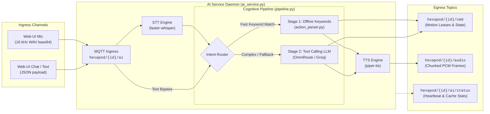

Here is the complete, uninterrupted version of **`pi-hub/services/ai-service/README.md`**:

---

# V2 Hexapod P5 — AI Voice Service (`pi-hub/services/ai-service/`)

Voice layer for the S3 hexapod: **local STT + local TTS on the RPi, remote LLM (Groq / OmniRoute)** per ADR-005 (amended 2026-08-16 — the 2 GB Pi 4 cannot host an in-RAM LLM; local `ollama` is an optional Pi-5+ upgrade).



---

## Layout

| File | Purpose |
|------|---------|
| `ai_service.py` | Entry point: MQTT client, worker thread, 5 s health heartbeat on `hexapod/{id}/ai/status`; `--mock` offline selftest. |
| `action_parser.py` | Stage-1 keyword matcher + LLM tool schema derived from `actions.json`. |
| `pipeline.py` | Decision coordinator (keywords → LLM → canned) + execution engine (publish + TTS + auto-stop TTL). |
| `providers/stt.py` | `faster-whisper` `tiny` int8 (lazy-loaded). |
| `providers/llm.py` | OpenAI-compatible client (Groq / OmniRoute), key from `/etc/hexapod-ai/groq.key` or `ai.env`. |
| `providers/tts.py` | `piper-tts` 1.6 `en_US-lessac-medium`, emits ≤4 KB binary PCM frames. |
| `actions.json` | **Canonical action table** (mirrors `docs/future-roadmap/ai-voice/actions.json`). |
| `deploy/` | Systemd unit + idempotent installer + artifact pre-downloader. |
| `selftest.py` | Standard-library contract and parser unit checks (runs offline without dependencies/broker). |

---

## Installation (Raspberry Pi)

```bash
# Run installer (installs systemd service & downloads model weights)
sudo ./deploy/install-ai-service.sh

# Configure API Key (ensure proper file ownership for daemon user)
sudo nano /etc/hexapod-ai/groq.key                  # one line: sk-...
sudo chown spider:spider /etc/hexapod-ai/groq.key   # service runs as spider

# Start & Enable Service
sudo systemctl restart hexapod-ai
systemctl status hexapod-ai
```

Artifacts land in `/opt/hexapod-ai/{models,voices}` (whisper `tiny`, piper medium).  
Dependencies install in an isolated environment at `/opt/hexapod-ai/venv` (never system pip).

---

## Verification & Diagnostics

```bash
# 1. Offline parser & contract verification (runs on any PC)
python3 selftest.py

# 2. Offline decision chain test across canned test corpus
python3 ai_service.py --mock --no-llm

# 3. Live daemon log stream on Raspberry Pi
journalctl -u hexapod-ai -f

# 4. Inject test command via MQTT
mosquitto_pub -t hexapod/hexapod-s3-01/ai -m '{"type":"text","role":"user","content":"do a spin"}'

# 5. Monitor all resulting robot telemetry, speech, and motion leases
mosquitto_sub -t 'hexapod/hexapod-s3-01/#' -v
```

---

## Full Conversation Memory

The Web-UI sends its visible chat log as a `history` array on every `hexapod/{id}/ai` message, granting the LLM **multi-turn context**:

```json
{
  "type": "text",
  "role": "user",
  "content": "and what did you say before?",
  "history": [
    { "role": "user",      "content": "hello robot" },
    { "role": "assistant", "content": "Hi! I'm Hexa, your six-legged companion." }
  ]
}
```

- **`history` is optional:** Backwards compatible with single-message clients. If absent, defaults to `[]`.
- **Prior turns only:** The caller must **not** include the current prompt inside `history` (the service automatically appends it as the final user turn).
- **Sanitization:** Roles are strictly sanitized to `user | assistant | system`.
- **Token Bounds:** `providers/llm.py` retains the **last 50 messages** (`MAX_LLM_HISTORY`). The Web-UI persists up to 200 messages in `sessionStorage`.

---

## Environment Knobs (`/etc/hexapod-ai/ai.env`)

| Variable | Default | Description |
|---|---|---|
| `DEVICE_ID` | `hexapod-s3-01` | Robot ID prefix for MQTT topic routing. |
| `LLM_MODEL` | `hexapod-vision` | Model endpoint identifier (e.g. `llama-3.3-70b-versatile`). |
| `LLM_BASE_URL` | `http://127.0.0.1:20128/v1` | Target OpenAI-compatible proxy or Groq base URL. |
| `LLM_ENABLED` | `1` | `1` = Dynamic LLM fallback; `0` = Stage-1 deterministic keywords only. |
| `AI_MODEL_DIR` | `/opt/hexapod-ai/models` | Base directory path for local STT/TTS weights. |

---

## LLM Response Cache

`providers/llm.py` maintains an in-process TTL+LRU cache of `(action_id, reply)` pairs keyed on `sha256(text + last-2-history + system)`. 

While Stage-1 keyword parsing short-circuits ~80% of common commands offline, this cache eliminates redundant cloud round-trips for repetitive LLM queries (e.g. repeated queries or page reloads).

- `AI_LLM_CACHE_TTL` (default `60` seconds, set to `0` to disable)
- `AI_LLM_CACHE_MAXSIZE` (default `256` entries)

Live telemetry metrics (`hits`, `misses`, `evictions`, `size`) are broadcasted on `hexapod/{id}/ai/status` within the `llm.cache` heartbeat payload.